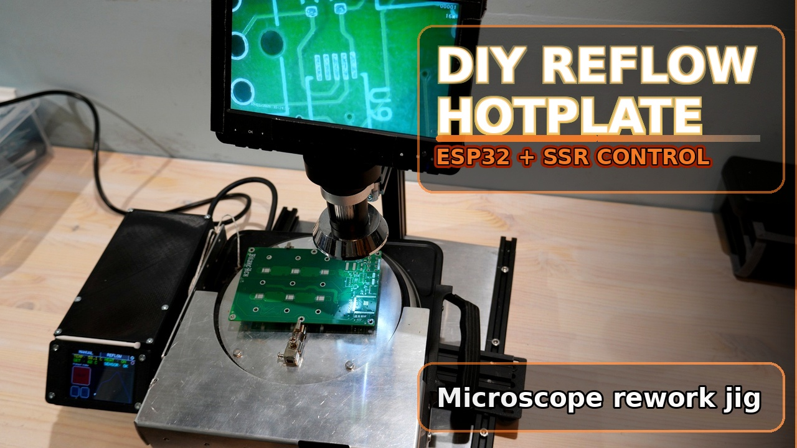

# DIY Reflow Hotplate

DIY PCB reflow hotplate and microscope rework jig built around a 1500 W single-burner hotplate, a large aluminum work surface, and an ESP32 touchscreen controller.

The original goal was to make large-board repair and preheating easier under a microscope, then extend the same machine into a basic reflow station.

YouTube build video: [https://youtu.be/tEUVSpoKs-g](https://youtu.be/tEUVSpoKs-g)

> This is a hobby / experimental project, not a certified product. If you build, copy, modify, or use anything from this repo, you do so at your own risk and under your own responsibility.

## What is in this repo

- cleaned-up project documentation
- ESP-IDF 5.5 firmware in `firmware/esp-idf-5.5/`
- Arduino sketch version in `firmware/arduino/hotplate_controller/`
- BOM with part links and raw build notes in `bom/`
- CAD files for the main plate and the control box enclosure
- build photos and the final YouTube thumbnail

## Current status

This machine works as a PCB preheater and rework station, and it can also run a reflow profile. It is still an experimental build, and the main thing still left to tune is the final calibration between the displayed temperature and the real working surface.

If you want the full build sequence, the YouTube video is the best companion to this repo. The repo keeps the important design choices, troubleshooting notes, and source files, while the video shows the complete build process.

## Main features

- 1500 W hotplate base with aluminum top plate
- rotating work surface for microscope work
- hand rest / armature around the hot zone
- ESP32 touchscreen controller with graph UI
- SSR-controlled heater output
- 100k NTC temperature sensing
- manual mode, reflow mode, and saved settings
- controller mounted close to the moving work area

## Build summary

- The project started because the Betax Hex PCB had large copper planes that were difficult to reflow with hot air alone.
- The first version was a simple hotplate with a marked mechanical thermostat and a laser-thermometer-verified preheat point.
- The final direction became a safer microscope rework jig with a rotating plate, hand rest, motion system, and ESP32 touchscreen control.
- The most important fixes were the display driver setup, the wrong 3.3 V header-pin mistake, and removing the thermal gap between the hotplate and the work plate.

## Safety

This project uses mains voltage, high current, and hot metal surfaces.

It is shared as build documentation for a personal hobby project. I cannot take responsibility for injury, fire, property damage, or other loss caused by building or using this project.

- build it only if you understand the electrical and thermal risks
- bond all intended metal chassis parts to earth
- use proper insulation, strain relief, and enclosure design
- never leave the machine unattended while powered or hot
- if you replicate the controller power supply, use a properly enclosed certified 5 V PSU instead of modifying a loose phone charger

## Repo layout

- `bom/` parts list, purchase links, and raw source notes
- `docs/` overview, build notes, firmware notes, tuning notes, and safety notes
- `firmware/` Arduino and ESP-IDF firmware versions
- `hardware/` controller, enclosure, and wiring documentation
- `mechanical/` frame, armature, and CAD files
- `media/` build photos, thumbnail, and video link
- `notes/` GitHub publishing helpers

## Quick start

1. Read `docs/07_safety.md` first.
2. Start with `docs/01_project_overview.md` and `docs/02_mechanical_build.md`.
3. Use `bom/BOM.md` or `bom/BOM.csv` for parts.
4. Choose either the Arduino or ESP-IDF firmware path under `firmware/`.
5. Calibrate the machine before trusting the displayed temperature.

## Still to finish

- final calibration table that maps setpoint to real surface temperature

## Possible future follow-up

- A later video may include a small controller PCB for the MOSFET and resistor section instead of the current perfboard approach.

## License

This repository is released under the MIT License. See `LICENSE`.
